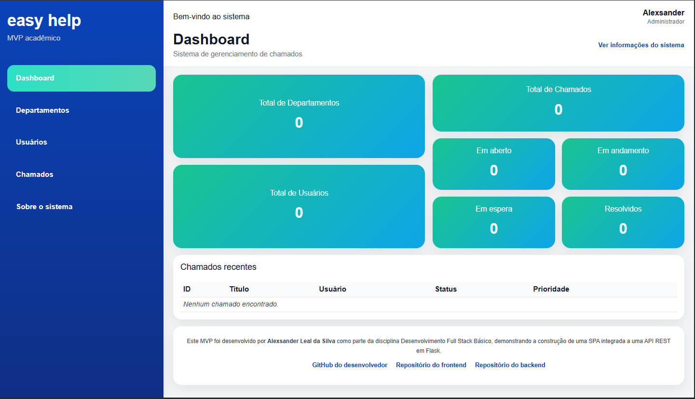

# 🛠️ Easy Help — Frontend (MVP)

O **Easy Help** é um MVP acadêmico desenvolvido como uma **Single Page Application (SPA)** utilizando **HTML, CSS e JavaScript puro**, com foco na simulação de um sistema de gerenciamento de chamados.

Este frontend foi projetado para funcionar de forma **independente**, incluindo um modo offline com simulação de API em memória, permitindo a execução completa sem necessidade de backend.

---


## 📸 Preview

> ⚠️ Imagem do Dashboad (versão desktop)



---

## 🎯 Objetivo

O objetivo deste projeto é demonstrar na prática:

- Construção de uma SPA sem frameworks  
- Organização modular de código frontend  
- Manipulação de DOM com JavaScript puro  
- Simulação de consumo de API REST  
- Criação de interfaces responsivas e funcionais  

---

## 🚀 Funcionalidades

### 📊 Dashboard
- Exibição de métricas:
  - Total de departamentos
  - Total de usuários
  - Total de chamados
- Resumo por status:
  - Em aberto
  - Em andamento
  - Em espera
  - Resolvidos
- Lista de chamados recentes

---

### 🏢 Departamentos
- Cadastro de departamentos
- Campos:
  - Nome
  - Sigla
  - Telefone
- Listagem em cards
- Filtro por busca em tempo real

---

### 👤 Usuários
- Cadastro de usuários vinculados a departamentos
- Campos:
  - Nome
  - Matrícula
  - Função
  - Departamento
- Listagem em cards
- Filtro de busca

---

### 📋 Chamados
- Cadastro de chamados vinculados a usuários
- Campos:
  - Título
  - Descrição
  - Prioridade
- Status inicial automático como **"Aberto"**
- Funcionalidades:
  - Atualizar status (resolver chamado)
  - Excluir chamado
- Filtros por:
  - Texto
  - Status
  - Prioridade

---

### ℹ️ Informações do Sistema
- Descrição do projeto
- Tecnologias utilizadas
- Fluxo de funcionamento

---

## 🧠 Fluxo da Aplicação

O sistema segue a seguinte lógica:

1. Criar um departamento  
2. Criar um usuário vinculado ao departamento  
3. Criar chamados vinculados ao usuário  
4. Gerenciar o status dos chamados  

---

## 🧱 Tecnologias Utilizadas

- HTML5  
- CSS3 (modularizado)  
- JavaScript puro (Vanilla JS)  
- Bootstrap (apoio visual)  

---

## 🧩 Arquitetura do Frontend

O projeto foi estruturado de forma modular para facilitar manutenção e escalabilidade.

### 📁 CSS
- `base.css` → estilos globais  
- `layout.css` → estrutura da aplicação  
- `components.css` → componentes reutilizáveis  
- `forms.css` → formulários e listas  
- `dashboard.css` → dashboard  
- `responsive.css` → responsividade  

---

### 📁 JavaScript
- `api.offline.js` → simulação de API (modo offline - padrão)  
- `api.online.js` → integração com API real (Flask)  
- `app.js` → estado global da aplicação  
- `navigation.js` → controle de navegação (SPA)  
- `departamentos.js` → lógica de departamentos  
- `usuarios.js` → lógica de usuários  
- `chamados.js` → lógica de chamados  
- `dashboard.js` → lógica do dashboard  
- `main.js` → inicialização da aplicação  

---

## 🗂️ Estrutura de Pastas

```text
easy-help/
│
├── index.html
│
├── assets/
│   ├── css/
│   │   ├── style.css
│   │   ├── base.css
│   │   ├── layout.css
│   │   ├── components.css
│   │   ├── forms.css
│   │   ├── dashboard.css
│   │   └── responsive.css
│   │
│   ├── js/
│   │   ├── api.offline.js
│   │   ├── api.online.js
│   │   ├── app.js
│   │   ├── navigation.js
│   │   ├── dashboard.js
│   │   ├── departamentos.js
│   │   ├── usuarios.js
│   │   ├── chamados.js
│   │   └── main.js
│
└── README.md 
```

---
## 🔄 SPA (Single Page Application)

A aplicação funciona como SPA:

- Apenas um arquivo HTML (`index.html`)  
- Navegação controlada via JavaScript  
- Troca de seções sem recarregar a página  

---

## 📱 Responsividade

O layout foi desenvolvido para diferentes tamanhos de tela:

- 🖥️ Desktop → sidebar fixa  
- 📱 Mobile → menu hambúrguer em tela cheia  
- 📲 Tablet → layout adaptado  

---

## 🔌 Modos de Execução

O projeto possui dois modos de funcionamento:

---

### 🟢 Modo Padrão — Offline (Simulação de API)

Por padrão, o sistema utiliza o arquivo:

~~~html
<script src="./assets/js/api.offline.js"></script>
~~~

Neste modo, o sistema funciona completamente sem backend, utilizando uma simulação de API em memória.

---

### 🔵 Modo Opcional — Integração com API

O projeto também permite integração com backend real utilizando o arquivo:

~~~text
assets/js/api.online.js
~~~

Para utilizar este modo, siga os passos abaixo:

---

### 1. Abra o arquivo `index.html`

Localize a linha:

~~~html
<script src="./assets/js/api.offline.js"></script>
~~~

---

### 2. Substitua pela referência do modo online

~~~html
<script src="./assets/js/api.online.js"></script>
~~~

---

### 3. Configure a URL da API

Abra o arquivo:

~~~text
assets/js/api.online.js
~~~

Verifique se a constante está apontando para a URL correta da sua API:

~~~javascript
const API_BASE_URL = "http://127.0.0.1:5000";
~~~

Se necessário, altere esse endereço conforme a porta ou host do seu backend.

---

### 4. Inicie o backend

Certifique-se de que a API esteja em execução e acessível.

---

### 5. Execute o frontend normalmente

Depois da troca, basta abrir o `index.html` no navegador.

---

## ▶️ Como Executar

### 🟢 Modo Offline (recomendado)

- Baixe ou clone o projeto  
- Abra o arquivo `index.html` no navegador  
- Utilize normalmente  

---

### 🔵 Modo Online (API real)

- Inicie o backend  
- Troque no `index.html` a referência de `api.offline.js` para `api.online.js`  
- Verifique a URL configurada no arquivo `assets/js/api.online.js`  
- Abra o `index.html` no navegador  